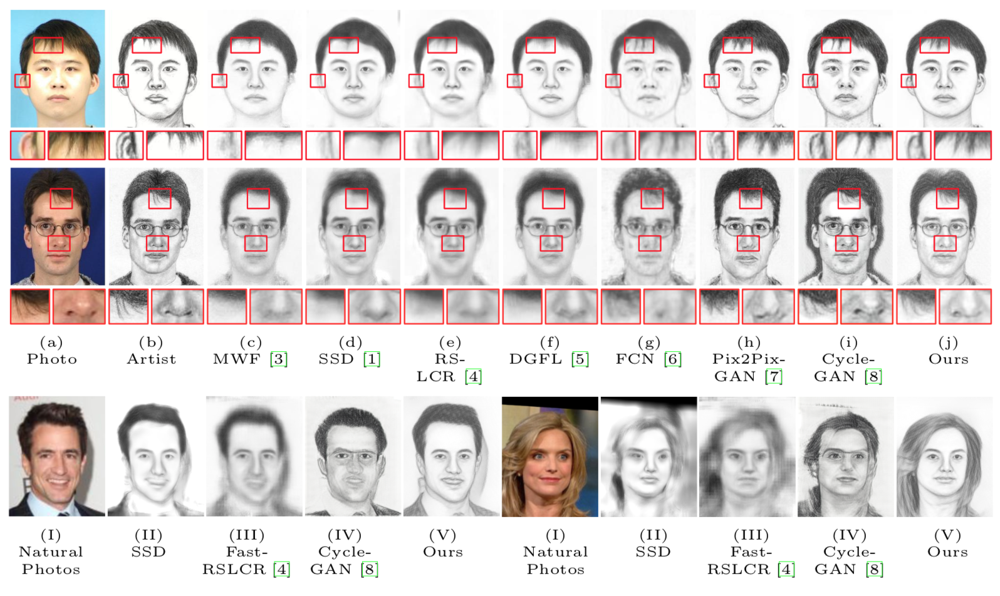

# Face Sketch Synthesis in the Wild

PyTorch implementation for face sketch synthesis in the wild through semi-supervised learning. Here is an example:



[**Semi-Supervised Learning for Face Sketch Synthesis in the Wild.**](http://cfchen.com/papers/face_sketch_wild(ACCV18).pdf)  
[Chaofeng Chen](https://cfchen.com/), [Wei Liu](http://www.visionlab.cs.hku.hk/people.html), [Xiao Tan](http://www.xtan.org/), [Kwan-Yee K. Wong](http://i.cs.hku.hk/~kykwong/).   

# Getting Started

## Prerequisite
- Pytorch 0.3
- torchvision 0.2
- opencv-python
- matlab_wrapper
- Matlab

## Datasets
- We use [CUFS](http://mmlab.ie.cuhk.edu.hk/archive/facesketch.html) and [CUFSF](http://mmlab.ie.cuhk.edu.hk/archive/cufsf/) dataset provided by Chinese University of Hong Kong (CUHK) to train our networks. You can also download them from [HERE](http://www.ihitworld.com/RSLCR.html).
- For the training of in the wild images, we use a subset of VGG-Face.

## Usage

### Download data and pretrained models.
Download the datasets and pretrained models using the following scripts
```
bash download_data_models.sh
```

### Quick Test
After download the datasets and pretrain models, use the provided script to test the model
```
python test.py 1  # Test on CUFS test set
python test.py 2  # Test on CUFSF test set
python test.py 3  # Test on CUHK_Student test set
python test.py 4  # Test on VGG test set
```
You can also test on your own test dataset. Simply change the `--test_dir` and `--test_weight_path`. If you have ground truth images, you can also specify `--test_gt_dir`.

### Train
1. Download the precalculated features for fast patch matching.
```
bash download_feature.sh
```
2. Configure training process.
- `vgg_select_num [0 or 10]`. `0`: no extra images in training. `10`: extra VGG-Face in training. **Only the largest vgg10 is provided here**.  
- `train_style [cufs, cufsf]`. use `cufs` or `cufsf` as the reference style.  

**The models in the paper are trained under 3 configurations**:
- `--vgg_select_num 0 --train_style cufs`. Model evaluated on CUFS. 
- `--vgg_select_num 0 --train_style cufsf`. Model evaluated on CUFSF. 
- `--vgg_select_num 10 --train_style cufs`. Model evaluated on VGG-Face. 

3. Train the model.
```
python train.py
```

# Citation

If you find this code or the provided data useful in your research, please consider cite:
```
@inproceedings{chen2018face-sketch-wild,
    title={Semi-Supervised Learning for Face Sketch Synthesis in the Wild},
    author={Chen, Chaofeng and Liu, Wei and Tan, Xiao and Wong, KKY},
    booktitle={Asian Conference on Computer Vision (ACCV)},
    year={2018},
}
```

# Resources

[1] [Random Sampling and Locality Constraint for Face Sketch Synthesis](http://www.ihitworld.com/RSLCR.html)  
[2] [Real-Time Exemplar-Based Face Sketch Synthesis](https://ybsong00.github.io/eccv14/index.html)

